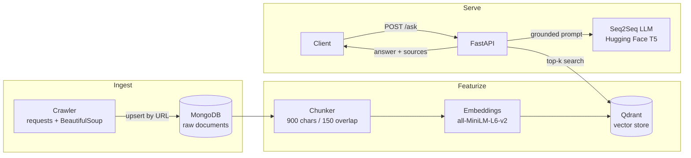

# ROS2 RAG Platform

[](https://github.com/SnigdhaSrivastva/ros2-rag-platform/actions/workflows/ci.yml)

A retrieval-augmented generation (RAG) service that answers engineering questions about **ROS2, Nav2, MoveIt2 and Gazebo**. It crawls the official documentation, embeds it into a vector store, and serves answers with source links through a FastAPI API.

> **Team project** (NYU, Fall 2024) built with [@ARDA7787](https://github.com/ARDA7787) and [@dhruvpandoh](https://github.com/dhruvpandoh).
> Original team repository: [ARDA7787/Retrival-Augmented-Generation-ROS2](https://github.com/ARDA7787/Retrival-Augmented-Generation-ROS2). The full commit history is preserved here.

## Architecture



| Stage | File | What it does |
|---|---|---|
| ETL | [`etl_pipeline.py`](rag_model/app/etl_pipeline.py) | Breadth-first, same-domain crawl of 4 doc sites. Links are normalized (fragments stripped, deduplicated). Idempotent **MongoDB upserts** keyed on URL, so re-runs don't create duplicates |
| Featurization | [`featurization_pipeline.py`](rag_model/app/featurization_pipeline.py) | Overlapping chunking, sentence-transformer embeddings, Qdrant collection bootstrap and upsert with a consistent payload (`text`, `url`, `source`, `chunk_id`) |
| API | [`main.py`](rag_model/app/main.py) | `POST /ask` retrieves top-k chunks and generates an answer grounded only in that context. Returns the answer plus source URLs. `GET /healthz` for liveness |
| Text processing | [`text_processing.py`](rag_model/app/text_processing.py) | Dependency-free chunking, prompt building, context collection and link normalization, covered by unit tests |
| Config | [`config.py`](rag_model/app/config.py) | Typed, environment-based settings (`pydantic-settings`), with no secrets in code |

## Engineering practices

- **Idempotent ingestion**: upsert semantics make the ETL safe to re-run
- **12-factor config**: everything comes from env vars / `.env` (see [`.env.example`](rag_model/.env.example))
- **Input validation** on the API (Pydantic, 3–2000 chars) and explicit 404/500 error paths
- **Structured logging** and a health endpoint for container orchestration
- **Containerized** with Docker / docker-compose
- Models and clients are loaded once at startup (FastAPI lifespan), not per request
- **CI**: GitHub Actions runs `ruff` lint and `pytest` on every push and PR

## Run it

```bash
cd rag_model
cp .env.example .env          # fill in MongoDB + Qdrant connection details

pip install -r app/requirements.txt
cd app
python etl_pipeline.py            # 1. crawl docs  -> MongoDB
python featurization_pipeline.py  # 2. chunk+embed -> Qdrant
uvicorn main:app --port 8000      # 3. serve API
```

Or with Docker: `cd rag_model && docker compose up --build`

```bash
curl -X POST localhost:8000/ask -H "Content-Type: application/json" \
     -d '{"question": "How do I configure a Nav2 costmap?"}'
```

## Tests

```bash
cd rag_model
pip install -r requirements-dev.txt
pytest
```

## Screenshots

| Running services | Gradio question-answering UI |
|---|---|
|  |  |

## Tech stack

Python · FastAPI · MongoDB · Qdrant · sentence-transformers · Hugging Face Transformers · PyTorch · Docker · Gradio
